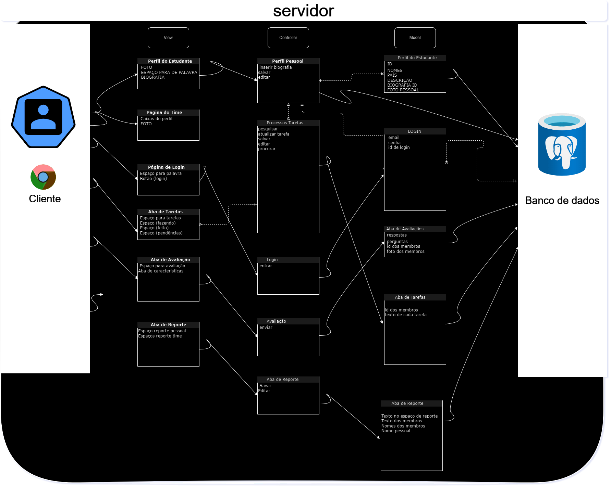

# Introdução ao MVC (Model-View-Controller)

O MVC é um padrão de arquitetura de software amplamente utilizado no desenvolvimento de aplicações web. Ele divide a aplicação em três componentes principais: o Modelo (Model), a Visualização (View) e o Controlador (Controller).

- O Models representa os dados e a lógica de negócio da aplicação. Ele é responsável por armazenar e manipular os dados, bem como realizar as operações necessárias.
- A View é responsável por exibir os dados ao usuário. Ela apresenta a interface gráfica ou a representação visual dos dados.
- O Controller atua como intermediário entre o Modelo e a Visualização. Ele recebe as requisições do usuário, processa as ações correspondentes e atualiza o Modelo e a Visualização conforme necessário.

MVC atividade individual
 
 

 
 
Fonte: Material produzido por David Deodato Alvarenga Nascimento (2024)

 

- *Servidor*: O servidor é o computador que hospeda a aplicação. Ele é responsável por processar as requisições do cliente e enviar as respostas.

- *Cliente*: O cliente é o navegador web do usuário. Ele é responsável por enviar as requisições para o servidor e exibir as respostas.

- *Banco de dados*: O banco de dados armazena os dados da aplicação. Ele pode ser um banco de dados relacional ou um banco de dados NoSQL

- *Perfil*: As caixas de perfil permitem que os usuários visualizem e editem seus perfis. Elas contêm informações como nome, foto, biografia e país.

- *Pagina de login*: A página de login permite que os usuários façam login na aplicação. Ela contém campos para inserir o email e a senha do usuário.

- *Aba de taretas*: A aba de taretas permite que os usuários gerenciem suas tarefas e vejam as dos seu grupo. Ela contém campos para adicionar, editar e excluir tarefas.

- *Aba de avaliação*: A aba de avaliação permite que os usuários avaliem seus 
colegas de equipe e a si mesmo. Ela contém campos para inserir a avaliação e o texto da avaliação.

- *Aba de reporte:* A aba de reporte permite que os usuários visualizem os relatórios da equipe. Ela contém campos para visualizar o texto do reporte pessoal e os textos dos membros da equipe.

O design da plataforma foi concebido para ser simples e intuitivo, mas ao mesmo tempo atraente, para capturar a atenção do usuário. Optamos por uma interface limpa, com apenas os botões necessários, minimizando a poluição visual e facilitando a navegação. A arquitetura do sistema foi projetada para guiar o usuário de maneira lógica e eficiente através dos diferentes estágios de interação:

- ## Tela de Login: 
Ponto de entrada, assegura que apenas membros autorizados tenham acesso.

- ## Tela de Questionário:
 Após o login, os usuários preenchem um questionário básico de dados pessoais, o que facilita a personalização da experiência subsequente.

- ## Home:
 Após o questionário, os usuários são direcionados à tela principal, onde podem acessar as tarefas dos membros e outras funcionalidades.

- ## Navegação: 
A partir da home, os usuários podem explorar outras abas como perfil, perfil dos membros, relatórios e avaliações, cada uma projetada para reforçar a interação e o entendimento mútuo entre os usuários.

## Como a Arquitetura Atende aos Objetivos e Requisitos do Projeto

A estrutura organizacional do site foi meticulosamente planejada para atender ao objetivo principal do projeto: facilitar a compreensão cultural e comportamental entre jogadores de diferentes países. A arquitetura suporta este objetivo através de várias funcionalidades:

- ## Avaliações Pessoais e de Grupo: 
Permitem que os usuários ganhem autoconhecimento e entendam como podem melhor interagir dentro do grupo.

- ## Biografias dos Membros:
 Proporcionam insights sobre o background cultural e pessoal de cada usuário, promovendo um maior entendimento mútuo.

- ## Aba de Relatórios: 
Oferece um espaço para os membros registrarem observações ou questões importantes, o que contribui para uma melhor compreensão das diferentes perspectivas e comportamentos.

Esses elementos são cruciais para que os participantes não apenas compartilhem informações, mas também desenvolvam uma compreensão profunda das nuances culturais que influenciam a dinâmica do grupo. 

